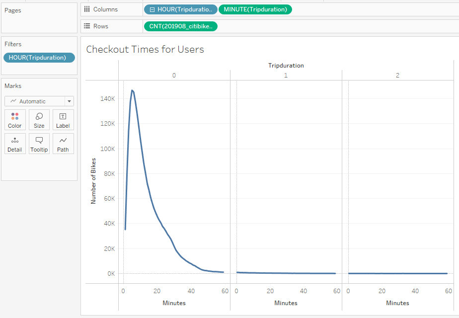
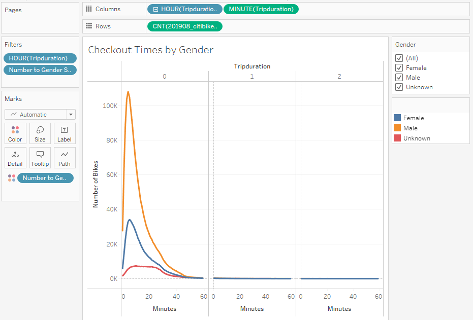
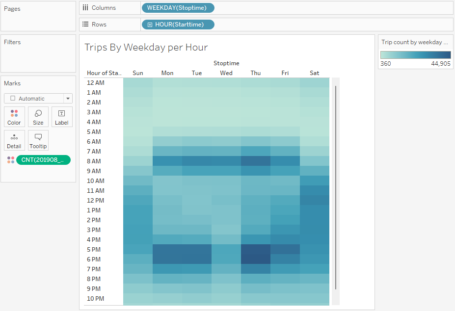
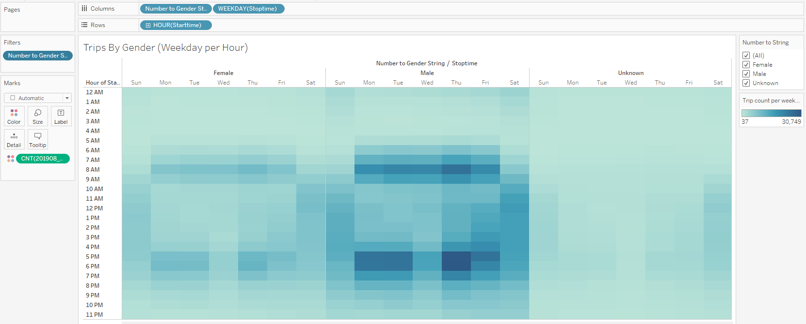
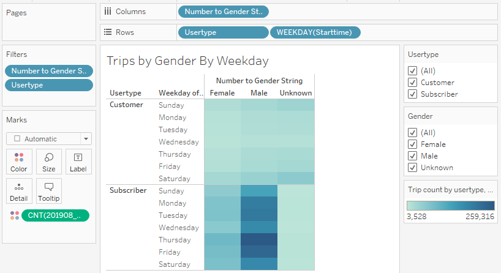
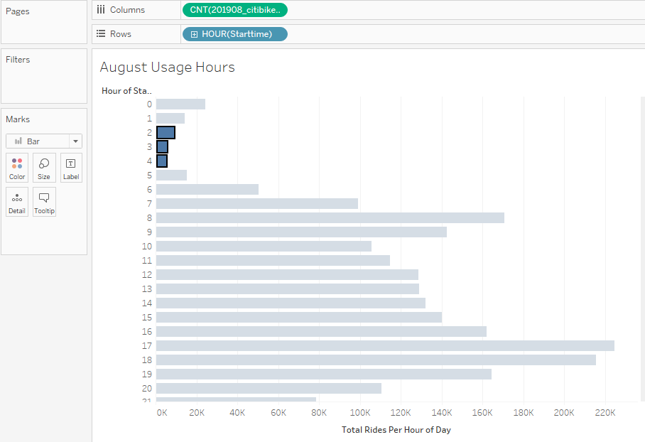
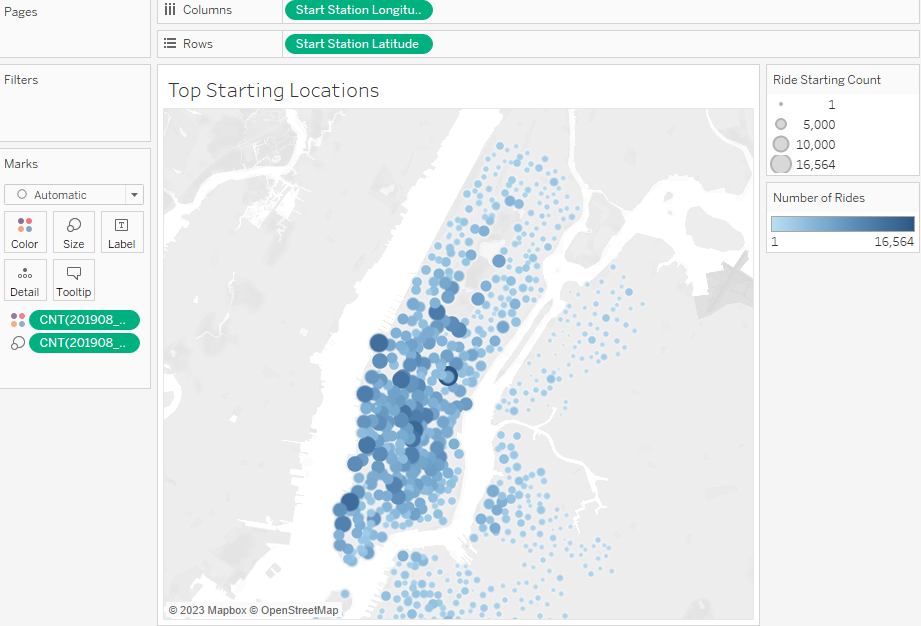

# bikesharing

## Project Overview

The purpose of this project was to analyze bikeshare data from CitiBike in New York City and share our findings with investors who are looking to begin a similar program in Des Moines, Iowa. The data covered ridership from August 2019 and included information such as gender and age of the riders, usage hours and duration, locations where rides would begin and end, and whether they were subscribers or not.

We used the following tools:
- Jupyter notebook to work update our Python file
- csv dataset that contained the bikesharing data
- Tableau that would be used to display the data.

## Results

### Deliverable 1: Change Trip Duration to a Datetime Format
The first step in preparing for our analysis was to clean the data. That required updating the trip duration field to a datetime field using jupyter notebook. we imported the csv file containing the data and created a dataframe. We checked the datatypes and converted the tripduration column from int64 to datatime64.

We then exported the dataframe as a new csv file without the index column.

### Deliverable 2: Create Visualizations for the Trip Analysis

We used the newly created csv file from deliverable 1 and imported it to a new Tableau workbook.

We created the following worksheets in Tableau.

##### Checkout Times for Users:
This visualization displays that most rides are less than 20 minutes in duration.

##### Checkout Times by Gender 
This visualization displays that most rides are from males followed by females.

##### Trips by Weekday for Each Hour
This visualization displays that most rides take place during the weekday before and after workhours. The highest concentration of rides takes place Monday, Tuesday, and Thursday.

##### Trips by Gender
We can see from this visualization that males are the most frequent riders.

##### User Trips by Gender by Weekday
We can see from this visualization that males are the most frequent riders during peak hours on weekdays.

### Deliverable 3: Create a Story and Report for the Final Presentation

## Summary

We used the worksheets created in Tableau for deliverable 2 to build our story.
[Tableau Story](https://public.tableau.com/shared/NDZN4BK6R?:display_count=n&:origin=viz_share_link)

- The results of our analysis indicate that male ridership is among the highest during the weekday suggesting that subscription services should be targeted towards this group.

- The peak usage time is before and after work hours indicating that the best time for repairs is early in the morning from 2am-4am. 

- We also know that most ridership takes place in the lower parts of NYC. This suggests that bike services should be readily available in those high traffic areas.

