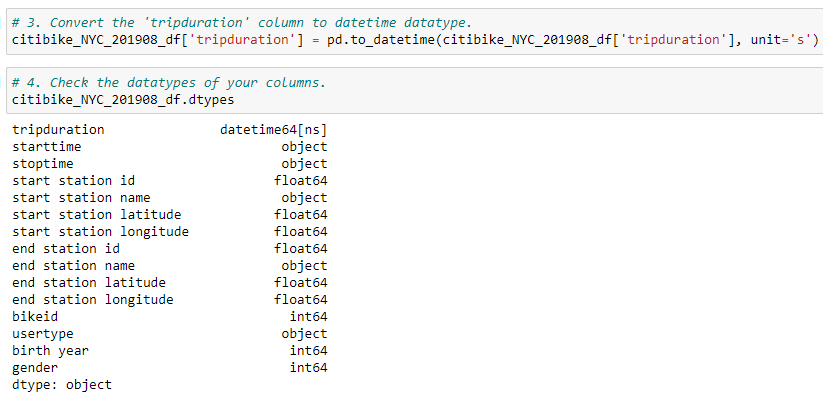

# bikesharing

## Project Overview

The purpose of this project was to analyze bikeshare data from CitiBike in New York City and share our findings with investors who are looking to begin a similar program in Des Moines, Iowa. The data covered ridership from August 2019 and included information such as gender and age of the riders, usage hours and duration, locations where rides would begin and end, and whether they were subscribers or not.

We used the following tools:
- Jupyter notebook to work update our Python file
- csv dataset that contained the bikesharing data
- Tableau that would be used to display the data.

## Results

The first step in preparing for our analysis was to clean the data. That required updating the trip duration field to a datetime field.

## Summary

[Tableau Story](https://public.tableau.com/shared/NDZN4BK6R?:display_count=n&:origin=viz_share_link)

- The results of our analysis indicate that male ridership is among the highest during the weekday suggesting that subscriotion services should be targeted towards this group.
- The lower parts of the city had the most concentrated ridgership suggesting that bike services should be readily available in high traffic areas.
- Bike repairs should be performed during non peak hours between 2am - 4am as to avoid times when ridership is high.